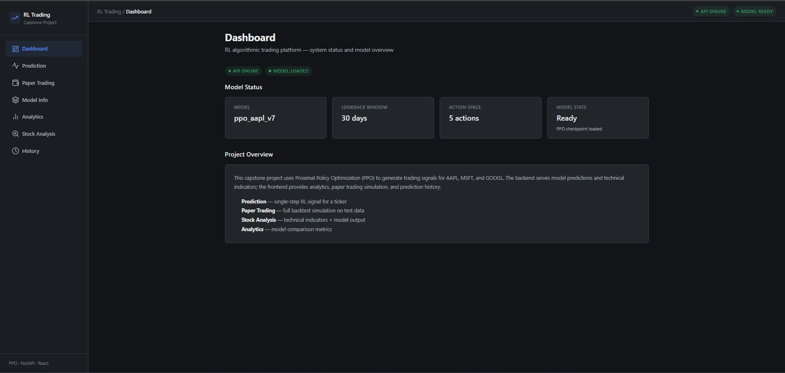
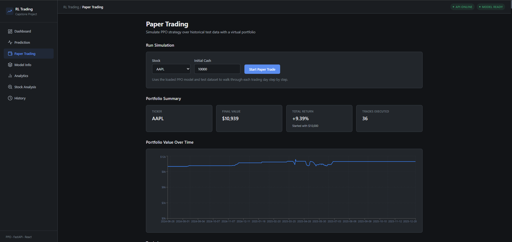
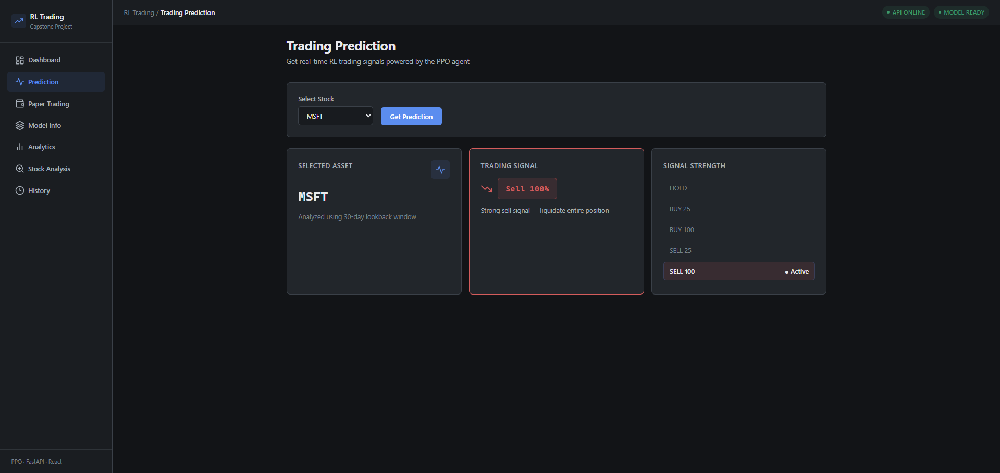
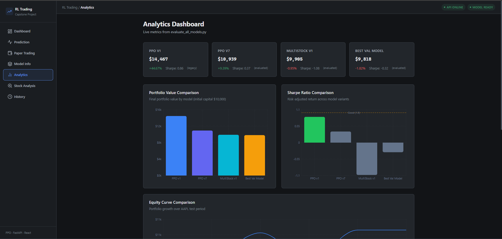

# RL Algorithmic Trading

A full-stack capstone project that uses **Proximal Policy Optimization (PPO)** to generate stock trading signals. Includes a FastAPI backend, React dashboard, technical analysis, paper trading simulation, and SQLite persistence.

Supported tickers: **AAPL**, **MSFT**, **GOOGL**

---

## Features

- **RL Predictions** — PPO agent generates HOLD / BUY / SELL signals
- **Paper Trading** — step-by-step backtest simulation on historical test data
- **Portfolio View** — session summary, equity curve, and trade log
- **Stock Analysis** — RSI, MACD, SMA indicators + model prediction
- **Analytics** — model comparison metrics and charts
- **Prediction History** — SQLite-backed signal log with search and pagination

---

## Tech Stack

| Layer | Technologies |
|-------|-------------|
| Frontend | React, TypeScript, Vite, Axios, React Router, Recharts |
| Backend | FastAPI, Uvicorn |
| ML/RL | Stable-Baselines3, Gymnasium, PyTorch |
| Data | Pandas, scikit-learn, yfinance |
| Database | SQLite |

---

## Project Structure

```
RL-algorithmic-trading/
├── backend/           # FastAPI app, services, SQLite
├── frontend/          # React + TypeScript UI
├── src/               # RL training, evaluation, trading env
├── data/              # Raw, processed, train/val/test CSVs
├── models/            # Trained PPO checkpoints (.zip)
├── results/           # Evaluation outputs, analytics JSON
├── docs/              # Development phase history
├── TRAINING.md        # Model training guide
└── render.yaml        # Backend deployment config
```

---

## Screenshots

| Dashboard | Paper Trading |
|-----------|---------------|
|  |  |

| Prediction | Analytics |
|------------|-----------|
|  |  |

---

## Prerequisites

- Python 3.10+
- Node.js 18+
- Trained model at `models/ppo_aapl_v7.zip` (see [TRAINING.md](TRAINING.md))

---

## Setup

### 1. Clone and install backend

```bash
cd RL-algorithmic-trading
python -m venv venv
source venv/bin/activate        # Windows: .\venv\Scripts\Activate.ps1
pip install -r requirements.txt
```

### 2. Prepare data (if not already present)

```bash
cd src
python download_data.py
python preprocess_data.py
python prepare_dataset.py
cd ..
```

### 3. Train model (required for predictions)

```bash
python src/train_improved.py
python src/evaluate_all_models.py
```

### 4. Install frontend

```bash
cd frontend
npm install
cp .env.example .env
cd ..
```

---

## Running Locally

**Backend** (from project root):

```bash
uvicorn backend.app:app --reload
```

API: http://127.0.0.1:8000  
Docs: http://127.0.0.1:8000/docs

**Frontend**:

```bash
cd frontend
npm run dev
```

UI: http://localhost:5173

---

## Paper Trading

1. Open **Paper Trading** in the sidebar
2. Select a ticker (AAPL / MSFT / GOOGL)
3. Click **Start Paper Trade**
4. View portfolio summary, equity curve, and trade log

Or via API:

```bash
curl -X POST http://127.0.0.1:8000/api/paper-trade/run \
  -H "Content-Type: application/json" \
  -d '{"ticker":"AAPL","initial_cash":10000}'
```

---

## API Overview

| Method | Endpoint | Description |
|--------|----------|-------------|
| GET | `/api/dashboard` | Model status summary |
| GET | `/api/model-info` | Model metadata |
| POST | `/api/predict` | Single RL prediction |
| GET | `/api/stock-analysis/{ticker}` | Indicators + prediction |
| GET | `/api/history` | Prediction history |
| GET | `/api/analytics` | Model comparison metrics |
| POST | `/api/paper-trade/run` | Run paper trading simulation |
| GET | `/api/paper-trade/history` | List paper trading sessions |
| GET | `/api/paper-trade/{id}` | Session detail + trades |

---

## Deployment

### Backend — Render

1. Push repo to GitHub
2. Create a new **Web Service** on [Render](https://render.com)
3. Use `render.yaml` or set:
   - **Build:** `pip install -r requirements.txt`
   - **Start:** `uvicorn backend.app:app --host 0.0.0.0 --port $PORT`
4. Set environment variables (see `.env.example`):
   - `CORS_ORIGINS=https://your-app.vercel.app`

### Frontend — Vercel

1. Import the repo on [Vercel](https://vercel.com)
2. Set **Root Directory** to `frontend`
3. Add environment variable:
   - `VITE_API_URL=https://your-api.onrender.com/api`
4. Deploy

See `.env.example` files in the project root and `frontend/` for all variables.

---

## Environment Variables

| Variable | Where | Default |
|----------|-------|---------|
| `CORS_ORIGINS` | Backend | `http://localhost:5173` |
| `VITE_API_URL` | Frontend | `http://127.0.0.1:8000/api` |

---

## Development History

Phase-by-phase build log: [docs/project_phases.md](docs/project_phases.md)

---

## Future Improvements

- Live market data (Yahoo Finance at request time)
- Support for additional tickers with per-stock models
- User authentication
- Model retraining from the UI

---

## License

Academic capstone project — for portfolio and educational use only. Not financial advice.
